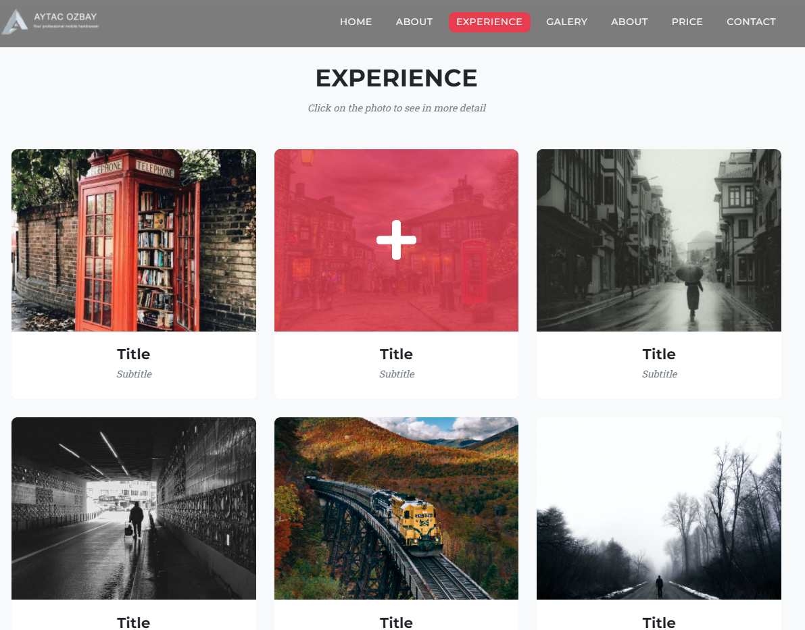

# Hairdressing Website

- This site was designed for a hairdresser in England, developed with HTML/CSS & JavaScript.
- Responsive design was also created.

> Completely original information has not been added to the site yet. 

> ***If you want to see the project you can [visit.](https://hairdressing.vercel.app/)***

___

## 📷 Screenshots

    
   

    

    

    

    

    

    

    